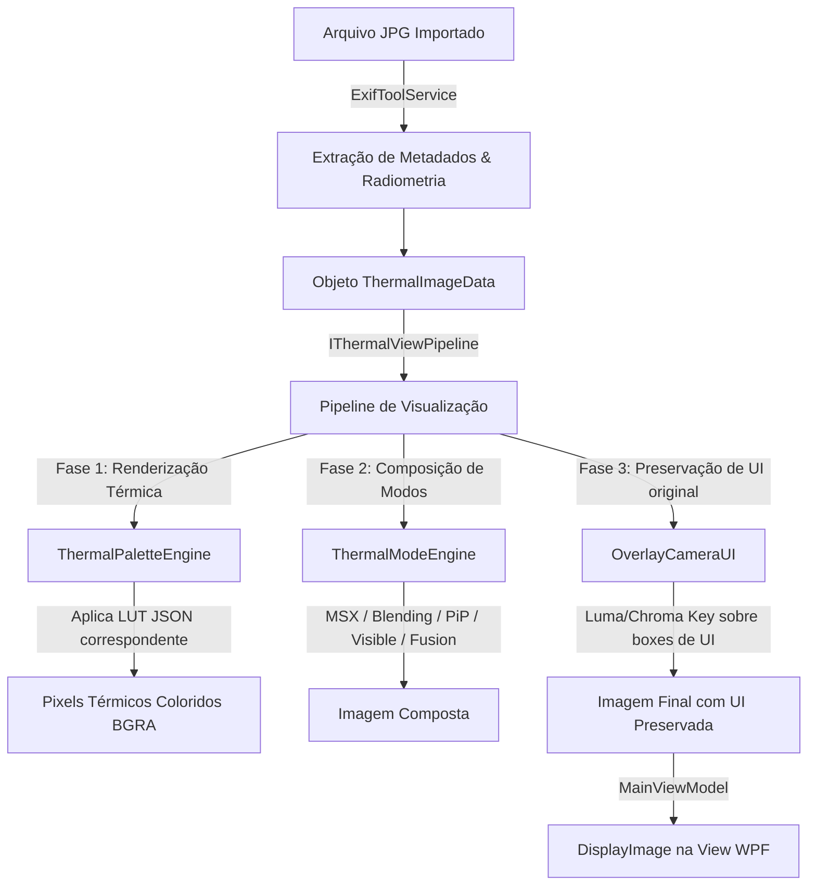

# Guia de Arquitetura: Importação, Renderização, Modos e Paletas Térmicas

Este documento serve como um guia técnico descritivo para desenvolvedores e mantenedores do **Thermix Studio**. Ele descreve como a imagem térmica original é importada, como os metadados são extraídos, como as paletas de cores (LUTs) são gerenciadas, e como ocorre a renderização e sobreposição de UI.

---

## 🗺️ Visão Geral do Fluxo de Dados

Abaixo está o fluxo percorrido por um termograma (por exemplo, um arquivo `.jpg` radiométrico de uma câmera FLIR) desde a importação até a exibição final na interface de usuário (UI):



---

## 📂 Arquivos de Código e Suas Responsabilidades

O fluxo está distribuído em três projetos principais da solução: `Core`, `Infrastructure` e `App`.

### 1. `ThermixStudio.Core` (Contratos e Modelos)
* **[IThermalAnalysisService.cs](file:///C:/Users/Leonam%20Dias/Documents/Projetos%20C%23/Thermix%20Studio/src/ThermixStudio.Core/Services/IThermalAnalysisService.cs)**: Define a interface para carregar os dados brutos e metadados de uma imagem térmica.
* **[IThermalViewPipeline.cs](file:///C:/Users/Leonam%20Dias/Documents/Projetos%20C%23/Thermix%20Studio/src/ThermixStudio.Core/Services/IThermalViewPipeline.cs)**: Fachada central que coordena a renderização, aplicação de paletas, modos de imagem e sobreposição de UI.
* **[IThermalPaletteEngine.cs](file:///C:/Users/Leonam%20Dias/Documents/Projetos%20C%23/Thermix%20Studio/src/ThermixStudio.Core/Services/IThermalPaletteEngine.cs)**: Contrato para aplicação de paletas térmicas (LUTs) e algoritmo de remapeamento inteligente (*ProcessSmartHD*).
* **[IThermalModeEngine.cs](file:///C:/Users/Leonam%20Dias/Documents/Projetos%20C%23/Thermix%20Studio/src/ThermixStudio.Core/Services/IThermalModeEngine.cs)**: Contrato para a composição de modos visuais térmicos (MSX, PiP, Blending, etc.) e sobreposição da UI original da câmera.
* **[ThermalImageData.cs](file:///C:/Users/Leonam%20Dias/Documents/Projetos%20C%23/Thermix%20Studio/src/ThermixStudio.Core/Models/ThermalImageData.cs)**: Modelo de dados que transporta a matriz de temperaturas (radiométrica em `double[,]`), a largura, a altura, o caminho da imagem e os metadados associados.

### 2. `ThermixStudio.Infrastructure` (Extração e Parsing)
* **[ExifToolService.cs](file:///C:/Users/Leonam%20Dias/Documents/Projetos%20C%23/Thermix%20Studio/src/ThermixStudio.Infrastructure/Services/ExifToolService.cs)**: Utiliza a ferramenta externa `ExifTool` para extrair metadados EXIF/MakerNotes do arquivo JPG.
* **[ThermalAnalysisService.cs](file:///C:/Users/Leonam%20Dias/Documents/Projetos%20C%23/Thermix%20Studio/src/ThermixStudio.Infrastructure/Services/ThermalAnalysisService.cs)**: 
  * Extrai a imagem térmica bruta (raw radiometric metadata).
  * Converte os dados binários de bytes (AD) para temperaturas em graus Celsius reais usando a fórmula matemática da FLIR:
    $$T = \frac{B}{\ln\left(\frac{R1}{R2 \cdot (Raw + F)} + O\right)} - 273.15$$

### 3. `ThermixStudio.App` (Implementação do Pipeline e ViewModels)
* **[ThermalViewPipeline.cs](file:///C:/Users/Leonam%20Dias/Documents/Projetos%20C%23/Thermix%20Studio/src/ThermixStudio.App/Services/ThermalViewPipeline.cs)**: Implementa `IThermalViewPipeline`. Encapsula os motores de paleta e modos para expor uma API simples e unificada ao ViewModel.
* **[ThermalPaletteEngine.cs](file:///C:/Users/Leonam%20Dias/Documents/Projetos%20C%23/Thermix%20Studio/src/ThermixStudio.App/Services/ThermalPaletteEngine.cs)**:
  * Gerencia o carregamento sob demanda de tabelas de cores (LUTs) a partir dos arquivos `.json` na pasta `/paletas`.
  * Renderiza a matriz `double[,]` para pixels BGRA baseando-se em limites de escala de temperatura (Mín/Máx).
  * Contém o algoritmo `ProcessSmartHD` para remapeamento de paleta base em capturas não radiométricas.
* **[ThermalModeEngine.cs](file:///C:/Users/Leonam%20Dias/Documents/Projetos%20C%23/Thermix%20Studio/src/ThermixStudio.App/Services/ThermalModeEngine.cs)**:
  * Executa algoritmos de fusão baseados em pixels: MSX (extração de Laplaciano da luz visível e injeção de contornos na térmica), Blending (Alpha Linear), PiP (Picture in Picture com máscara central) e Fusion (Isotermas).
  * **OverlayCameraUI**: O método crítico que preserva a identidade da câmera (Logos, textos de temperatura, mira central, barra de escala e marcas) recortando esses elementos e colando-os por cima da imagem processada.
* **[MainViewModel.cs](file:///C:/Users/Leonam%20Dias/Documents/Projetos%20C%23/Thermix%20Studio/src/ThermixStudio.App/ViewModels/MainViewModel.cs)**: Controla o estado de exibição, reage a mudanças na UI (mudança de paleta, alteração de modo de exibição, escala térmica manual ou automática) e chama o método `UpdateDisplayImage()` para disparar a atualização na tela.

---

## 🔌 De onde vêm os Metadados e como são tratados?

1. **Leitura**: Quando uma imagem é importada, o `ExifToolService` executa um subprocesso do `ExifTool` para dump de metadados binários e tags MakerNotes da FLIR.
2. **Parâmetros Radiométricos**: Tags cruciais como `PlanckR1`, `PlanckB`, `PlanckF`, `PlanckO`, `PlanckR2`, juntamente com variáveis ambientais (emissividade, umidade refletida, temperatura atmosférica), são lidas e passadas ao `ThermalAnalysisService`.
3. **Conversão**: O array bidimensional de pixels crus é transformado em graus Celsius. Essa matriz final é guardada em `ThermalImageData.Temperatures`.

---

## 🎨 Gerenciamento de Paletas (LUTs)

As paletas de cores são arquivos JSON localizados na pasta `paletas/` (geralmente copiada para a pasta do binário de build em runtime). 
* **Formato**: Cada arquivo (exemplo: `iron_lut.json`) possui um objeto contendo o nome da paleta e uma matriz `rgb` de 256 cores:
  ```json
  {
    "name": "iron",
    "rgb": [
      [0, 1, 65],
      ...
      [248, 237, 254]
    ]
  }
  ```
* **Renderização**: No método `RenderThermalWithPaletteAsync` do `ThermalPaletteEngine`, o valor Celsius é normalizado entre $[0.0, 1.0]$ com base no intervalo de temperatura atual (`levelMinC` a `levelMaxC`). Esse valor normalizado aponta para um índice entre $0$ e $255$ no vetor RGB correspondente para gerar o byte BGRA final.

---

## 🖼️ Fluxo de Composição de Modos e UI Overlay

Quando o usuário alterna modos de visualização (ex: mudando para **MSX** ou **PiP**):
1. **Composição Base**: O `ThermalModeEngine.RenderMode` cria a imagem combinando a imagem térmica renderizada e os pixels da luz visível extraída (se disponível).
2. **Corte e Sobreposição da UI (OverlayCameraUI)**:
   * A fim de preservar a barra de escala original, miras, caixa de temperatura máxima/mínima e logotipos da câmera, o método `OverlayCameraUI` analisa o buffer JPG original importado (`originalPixels`).
   * Ele percorre seis zonas de delimitação (Bounding Boxes) calibradas para a proporção original do termograma:
     * **Temperatura do Alvo** (Topo Esquerdo)
     * **Temperatura Máxima - Tmax** (Topo Direito)
     * **Temperatura Mínima - Tmin** (Base Direita)
     * **Logo FLIR** (Base Esquerda)
     * **Moldura e textos da Barra de Escala** (Direita)
     * **Crosshair / Mira Central** (Centro da imagem)
   * **Filtro de Luma/Chroma Key**: Em cada uma dessas áreas, se um pixel original tiver **saturação baixa** (diferença $RGB \le 30$, indicando tom de cinza, preto ou branco puro) e for **muito escuro** ($Luma < 50$) ou **muito claro** ($Luma > 185$), ele é classificado como elemento de UI/Texto e é copiado sobreposto à imagem gerada.
   * Isso garante que a cena térmica seja atualizada livremente por baixo enquanto as informações estáticas da câmera são mantidas com nitidez impecável.

---

## 🛠️ Como dar manutenção ou atualizar?

* **Adicionar uma nova Paleta de Cores**:
  1. Crie ou baixe o array RGB de 256 elementos da paleta.
  2. Salve no formato JSON apropriado na pasta `src/ThermixStudio.App/paletas/` com o padrão `<nome>_lut.json`.
  3. Adicione o mapeamento do nome amigável no dicionário `lutFiles` dentro de `ThermalPaletteEngine.cs` (método `LoadAllLutsAsync`).
  4. Insira a opção de enum correspondente em `ThermalPalette` (`ThermixStudio.Core`) para habilitá-la no menu principal.

* **Ajustar ou Adicionar Elementos de UI da Câmera**:
  * Modifique os limites dos retângulos no vetor `uiBoxes` dentro de `ThermalModeEngine.cs` (método `OverlayCameraUI`).
  * Para ajustar a sensibilidade do que é considerado texto ou logotipo, aumente ou diminua os limiares de saturação (`maxSaturation`), brilho preto (`darkThreshold`) ou brilho branco (`brightThreshold`).
